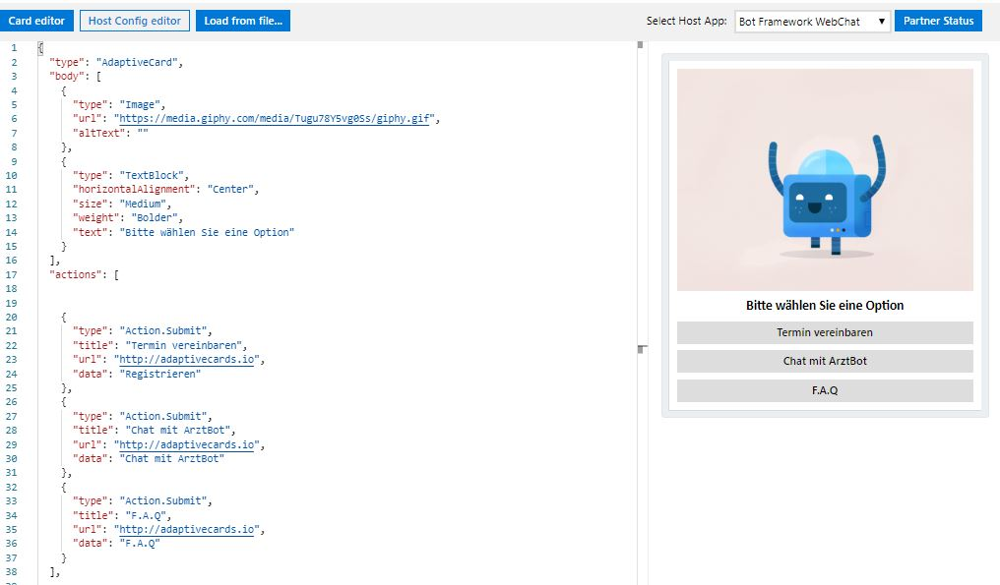

# AI-chatbot-type-dispatch
Chatbot application of type Dispatch (parallel use of Luis and Qna) with help of Azure services
## [Use multiple LUIS and QnA models](https://docs.microsoft.com/en-us/azure/bot-service/bot-builder-tutorial-dispatch?view=azure-bot-service-4.0&tabs=cs)
## [totally worth reading dispatch command line tool](https://github.com/microsoft/botbuilder-tools/tree/master/packages/Dispatch)
## [Microsoft Azure: Cloud Computing Services](https://azure.microsoft.com/en-us/free/search/?&ef_id=EAIaIQobChMI3eb947vy6QIVDO3tCh2EBg9gEAAYASAAEgKNpvD_BwE:G:s&OCID=AID2000076_SEM_EAIaIQobChMI3eb947vy6QIVDO3tCh2EBg9gEAAYASAAEgKNpvD_BwE:G:s&dclid=CMO6hou88ukCFQjKuwgdzpIBZw)

